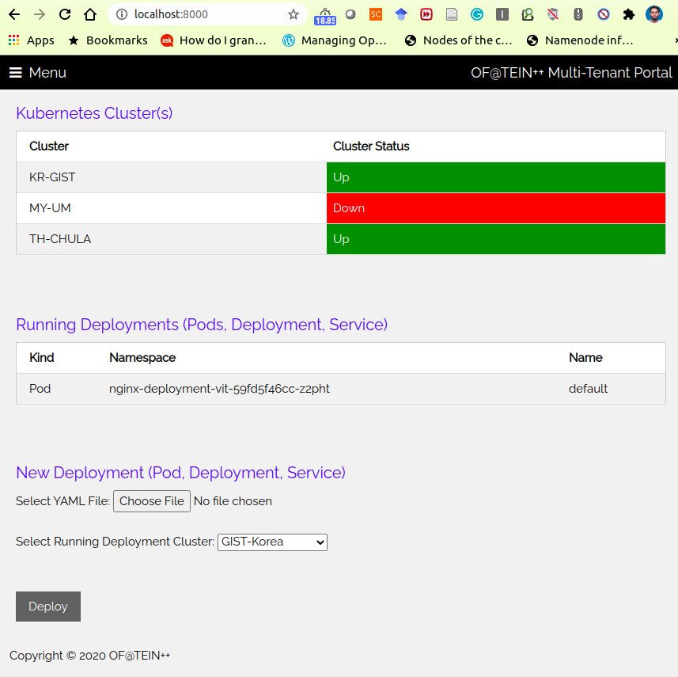

# OF@TEIN++ Multi-Tenant-Portal Frontend App
This is the front-end application of OF@TEIN++ Multi-tenant Portal.

### Application Description

- Cluster Status (Shows existing cluster(s) running status)
- Running Pods (Shows existing Pods for the current user)
- New Deployment (Deploys new object from YAML description file to selected cluster)

### Developer Reference 
- [Practice Tutorial](https://gabrieleromanato.name/nodejs-social-login-in-expressjs-using-twitter-google-facebook-and-linkedin-with-passport)

- [Express Docker App](https://nodejs.org/en/docs/guides/nodejs-docker-webapp/)

- [Social Login](https://github.com/vyasparth/express-social-login)

- [Template Source](https://www.w3schools.com/w3css/tryw3css_templates_analytics.htm#)